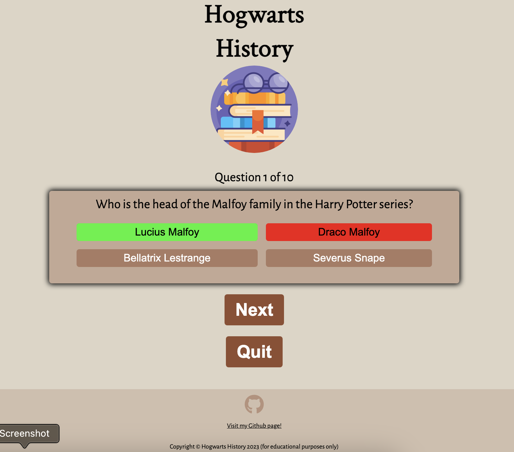
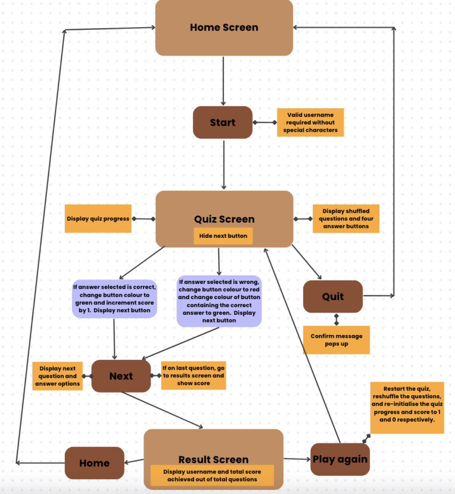

---

# **HOGWARTS HISTORY**

The Hogwarts History web quiz app is for Potterheads, fans of the Harry Potter book series, who wish to have fun and test their knowledge of the Potterverse and the Wizarding World conjured by the author J.K. Rowling, as well as to prove to a certain Miss Hermione Granger that they have indeed read the textbook called "Hogwarts: A History".

The website can be accessed by this [link](https://marcgithub23.github.io/pp2-hogwarts-history/)

---

## USER STORIES

### As a user:

- I want to immediately understand how the web quiz app works without difficulty through intuitive user interface design and controls.
- I want to know if I have entered the correct username to start the quiz and receive an alert message if not.
- I want to get immediate feedback on whether I selected the correct answer, and if not, I want to know which one was the correct answer straight away.
- I want to be able to click next and move on to the next question, as well as be able to quit and go back to the home screen at any point during the quiz.
- I want to be able to know my progress during the quiz and find out which question I'm on out of the total number of questions.
- I want to find out my total score at the end of the quiz, as well as have the ability to play again or go back to the home screen.

---

## Features

### Home Screen Display

- The header on top contains the title of the web quiz app and the logo.
- The display contains a brief introduction on what the quiz is about, calling them to action to start the quiz and test their knowledge.
- It contains a text input where users can enter their desired username.
- It contains a start button to start the quiz. An alert message pops up to prompt users to enter a username if left blank. Another alert message pops up if users enter an invalid username with special characters.
- The footer contains an icon that links to my GitHub page, which will open it in a new tab, as well as copyright and a disclaimer about educational purposes only.

### Quiz Screen Display

- The display contains both header and footer as the home screen.
- It displays the quiz progress, question, buttons for four different answer options, and the next and quit buttons.
- The next button is initially hidden and only shows when users have selected an answer.
- If the answer selected is correct, the button changes its colour to green.
- If the answer selected is wrong, the selected button changes its colour to red and the button containing the correct answer changes its colour to green.
- Users cannot re-select a different answer once they have selected an answer button. They can only click the next or quit button.
- If users click quit, an alert message pops up to ask them to confirm that they want to quit. If they click OK, they are brought back to the home screen display.
- If users click next, the next question is displayed along with its four different answer options. The question progress also updates and hides the next button again. After answering the last question, the next button brings users to the results screen display.

### Results Screen Display

- The display contains both header and footer as the home and quiz screens.
- It contains a template literal message that includes the entered username and the total score achieved out of the total questions.
- It contains a play again button that will restart the quiz, reshuffle the questions, and re-initialise the quiz progress and score to 1 and 0 respectively.
- It also contains a home button that will bring users back to the home screen.

---

## Flowchart

The below flowchart shows the logic of the web quiz app:

---

## Technologies Used

- [HTML](https://developer.mozilla.org/en-US/docs/Web/HTML) was used to build the foundation of this website.
- [CSS](https://developer.mozilla.org/en-US/docs/Web/css) was used to format and style the website.
- [CSS Flexbox](https://developer.mozilla.org/en-US/docs/Learn/CSS/CSS_layout/Flexbox) was used to organise the items symmetrically on the website.
- [JavaScript](https://www.w3schools.com/js/) was used to add interactivity and code functions needed to run the web quiz app.
- [Canva](https://www.canva.com/) was used to create flowchart and wireframes for the website.
- [VSCode](https://code.visualstudio.com/) was used as the main tool to write and edit code.
- [Git](https://git-scm.com/) was used for the version control of this website.
- [GitHub](https://github.com/) was used to host the code of this website.

---

## Design

### Colour Scheme

- The above colour palette was used for the colour scheme of the website. It is a colour gradient from beige (primary colour) to brown (secondary colour), reminiscent of the light and dark academia aesthetics, which are appropriate for a literary trivia quiz on the Harry Potter series.
- Beige:
    - Body background colour: #ddd5c6
    - Footer background colour: #d0bfad
    - Container background colour: #c3a894
- Footer GitHub icon link colour: #b7927c
- Brown:
    - Answer buttons background colour: #aa7b63
    - Start, next, and quit buttons background colour: #904e31
- Green for correct answer: #26f42d
- Red for wrong answer: #f40f0f

### Typography

The following family fonts have been imported from Google Fonts:

- Crimson Text for h1 heading
- Changa for h2 heading
- Alegreya Sans for the rest of the elements (i.e., p, button, etc.)

### Wireframes