# TESTING

## Compatibility

The website was tested on Google Chrome and Safari web browsers to check functionality, responsiveness, and appearance.

## Responsiveness

The website was inspected using devtools to check its responsiveness, for example, the answer buttons on the quiz screen display split into two columns to make use of the extra space.

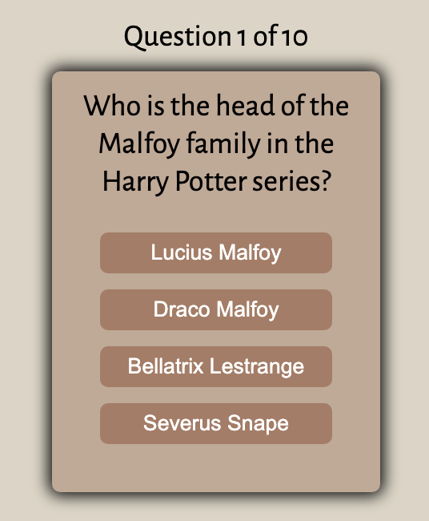

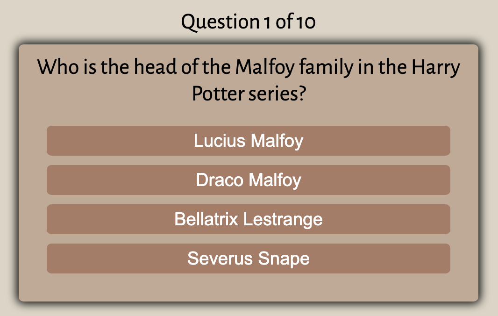

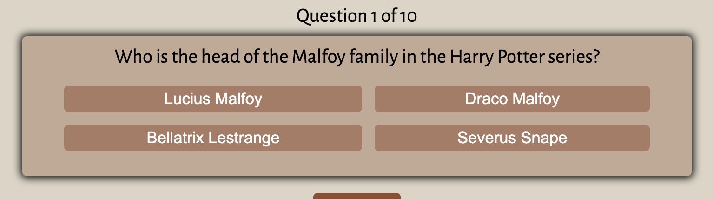

Additionally, the website's responsiveness on different devices has been tested using a Google Chrome extension called [Responsive Viewer](https://chrome.google.com/webstore/detail/responsive-viewer/inmopeiepgfljkpkidclfgbgbmfcennb). The following devices were selected for testing:

- Galaxy S9, Note 8, S8 (360 x 740)
- iPhone 6/7/8 Plus (414 x 736)
- iPad (768 x 1024)
- Kindle Fire HDX (800 x 1280)
- Laptop (1280 x 800)

A [pdf](documentation/different-devices.pdf) generated by using a Google Chrome extension called [GoFullPage](https://chrome.google.com/webstore/detail/gofullpage-full-page-scre/fdpohaocaechififmbbbbbknoalclacl) is available.

## Manual Testing

### Home Screen

| Feature | Action | Expected Result | Tested | Passed | Comments |
| --- | --- | --- | --- | --- | --- |
| Username | Enter valid username | Alert message pops up if empty or invalid | Yes | Yes | Alphanumeric values and space in between are allowed but not front and end trailing spaces |
| Start button | Click to start quiz | Displays quiz screen with the first question and four answer options | Yes | Yes | Questions are shuffled. Hover effect on button on laptop or desktop devices |

### Quiz Screen

| Feature | Action | Expected Result | Tested | Passed | Comments |
| --- | --- | --- | --- | --- | --- |
| Quiz progress | Display question number | Informs user what question number they are on out of the total number of questions | Yes | Yes | None |
| Answer buttons | Select an answer | Selected button turns green if correct and increments score by 1. It turns red if wrong and also shows the correct answer and the next button appears | Yes | Yes | In a two-column layout on laptop or desktop devices |
| Quit button | Click to quit | The user is brought back to the home screen | Yes | Yes | Hover effect on button on laptop or desktop devices |
| Next button | Click to continue | Next question is displayed and quiz progress is updated | Yes | Yes | If on last question, user is brought to the results screen |

### Results Screen

| Feature | Action | Expected Result | Tested | Passed | Comments |
| --- | --- | --- | --- | --- | --- |
| Total score | Display results | Informs user of total score achieved out of the number of total questions, percentage, and a message depending on the percentage achieved | Yes | Yes | None |
| Play again button | Click to play again | The user is brought back to the quiz screen with reshuffled questions and re-initialised score and quiz progress | Yes | Yes | Hover effect on button on laptop or desktop devices |
| Home button | Click to go home | The user is redirected back to the home screen | Yes | Yes | Hover effect on button on laptop or desktop devices |

---

## Validator Testing

### HTML

No errors or warnings were found when passing through the official W3C validator.

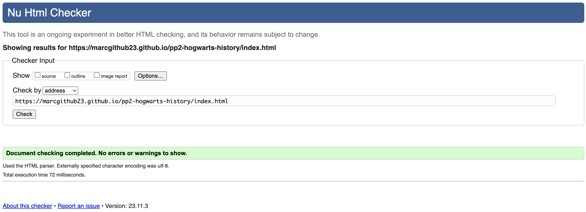

### CSS

No errors or warnings were found when passing through the official W3C Jigsaw validator.

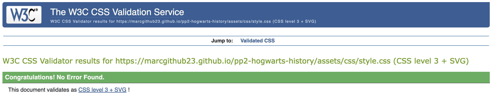

### JS

No errors or warnings were found when passing through the official JSHint validator.

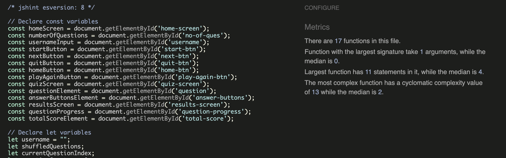

---

## Lighthouse Report

- Lighthouse in devtools checks that the website scores high in performance, accessbility, best practices, and SEO.

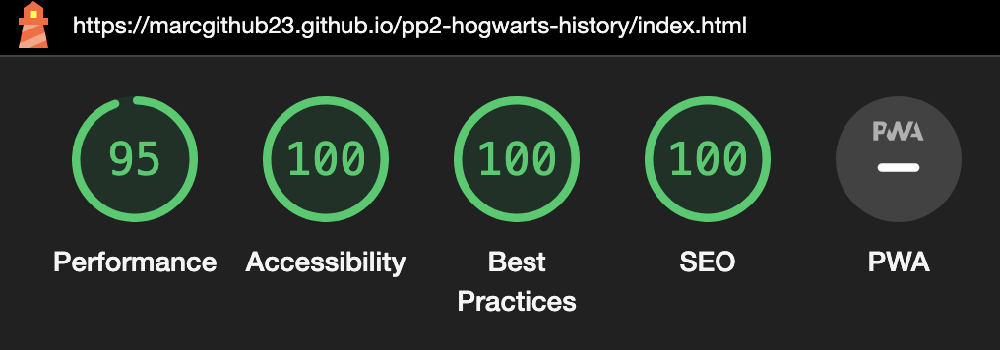

---

## Bugs or Issues

### Solved bugs or issues:

- Play again button doesn't hide results screen.
    - Fix: initially reused startGame function, but had to create a new restartGame function to clear results screen.
- The function handleNextButton doesn't work properly.
    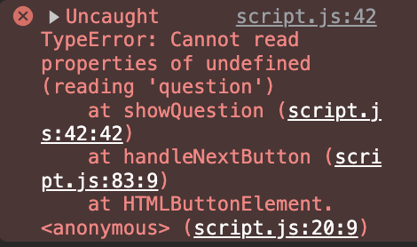
    - Fix: initially used the wrong function showQuestion. Used the correct function setNextQuestion.
- Question progress keeps counting over the total number of questions after clicking the play again button.
    - Fix: reset questionCounter to 0 within the restartGame function.
- The code breaks and questions and answers don't show properly when moving numberOfQuestions.innerHTML above const questions.
    - Fix: put numberOfQuestions.innerHTML within a DOMContentLoaded event
- HTML initial validation error.
    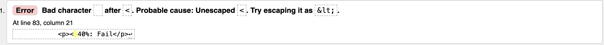
    - Fix: replaced correct symbol for less than;
- CSS initial validation error.
    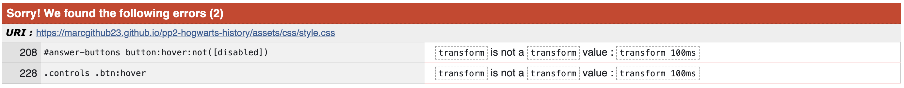
    - Fix: corrected typo.
- JS initial validation error.
    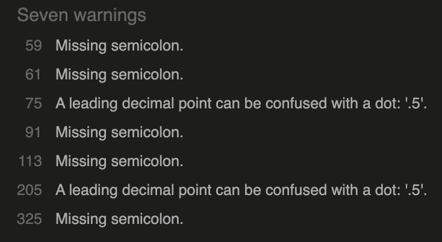
    - Fix: add missing semi-colons and missing 0 in .5

### Unsolved bugs or issues:

- There were no known bugs at the time of submission of this project.